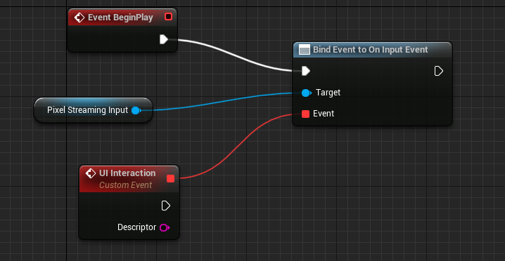
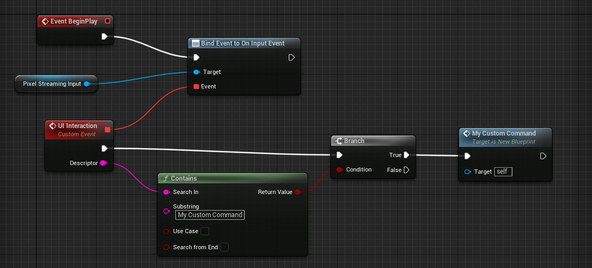
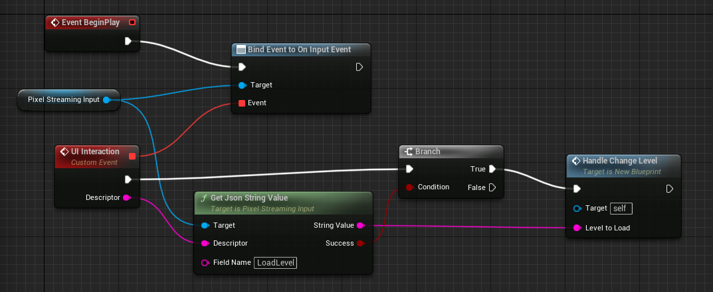

## Communicating from the Player Page to UE5

The frontend provides three functions that you can call in your HTML player page to allow the user to pass events and commands from the browser to your Unreal Engine application:

*	`emitCommand` Allows sending arbitrary commands to the game in the form of JSON objects.
*   You can use `emitConsoleCommand` to send console commands back to Unreal Engine. For example, `stat fps` to show the frame rate. See [Using the emitCommand Function below](#using-the-emitcommand-function).
*   `emitUIInteraction` sends any arbitrary string or object to the game. Use this function to send your own custom commands from your player UI, which you can respond to in your gameplay logic to produce any effect you need in your application. See [Using the emitUIInteraction Function below](#using-the-emituiinteraction-function).


### Using the emitCommand Function

When you call the `emitCommand` function, you pass it an object which then gets converted to JSON and sent onward to the game. This can then be used for implementing any sort of custom functionality you may require.

#### Reserved Keywords

Though you are given free reign to organize commands how you see fit, if the object contains a key with one of the following reserved keywords it will be interpreted by the PixelStreaming module instead:

*   `ConsoleCommand` \- Use this key to execute a console command on the remote Unreal Engine application. The value of this key should be a string that contains the command you want to run, along with any parameters it needs. For example:

```typescript
	let descriptor = {
		ConsoleCommand: 'stat fps'
	}
	emitCommand(descriptor);
```

**_NOTE:_**
Due to the power of the Unreal Engine console commands, the `emitConsoleCommand` function can present a security risk. In order for this function to work, you also need to provide the `-AllowPixelStreamingCommands` parameter on the command line when you launch your Unreal Engine application or start it from the Unreal Editor using the Standalone Game option.


### Using the emitConsoleCommand Function

You may also use `emitConsoleCommand` to pass Unreal Engine console commands as a string. Like passing commands via `emitCommand`, you must provide `-AllowPixelStreamingCommands` on the command line when you launch your Unreal Engine application in order for these commands to be fielded.


### Using the emitUIInteraction Function

When you call the `emitUIInteraction` function, you can pass it a single string or object. For example:

```typescript
	emitUIInteraction("MyCustomCommand");
```

or

```typescript
	const descriptor = {
		LoadLevel: "/Game/Maps/Level_2",
		PlayerCharacter: {
			Name: "Shinobi",
			Skin: "Dynasty",
		},
	};
	this.stream.emitUIInteraction(descriptor);
```

If you pass an object, the `emitUIInteraction` function converts it to a JSON string internally. It then passes the resulting string back to the Pixel Streaming Plugin in your Unreal Engine application, which raises an event on the input controller. In your application's gameplay logic, you bind your own custom event to handle these inputs, using the **Pixel Streaming Input > Bind Event to On Input Event** node. For example:

<p align="center">
    
</p>

You need to bind this event once, typically at the start of your game. Each time any player HTML page connected to an instance of your Unreal Engine application calls the `emitUIInteraction` function, your custom event is automatically invoked, regardless of the input passed to `emitUIInteraction`.

The custom event you assign (for example, the **UI Interaction** node in the image above) has an output named **Descriptor**, which you can use to retrieve the string that was sent to your Unreal Engine application by the `emitUIInteraction` function. You can use that value to determine how your gameplay code needs to respond each time `emitUIInteraction` is called.

For example, the following Blueprint tests to see whether the input given to `emitUIInteraction` contains the string "MyCustomCommand", and calls a custom function to handle the event:


<p align="center">
    
</p>

If you originally passed a JavaScript object to `emitUIInteraction`, you can retrieve the value of any key from that JSON object using the **Pixel Streaming > Get Json String Value** node. For example, the following Blueprint tests for a key named LoadLevel. If that key is present, it calls a custom function to handle the event:


<p align="center">
    
</p>


**_Tip:_**
If you need to retrieve a nested key, use the dot notation common in TypeScript for your key.
For example, `PlayerCharacter.Name` or `PlayerCharacter.Skin`.

