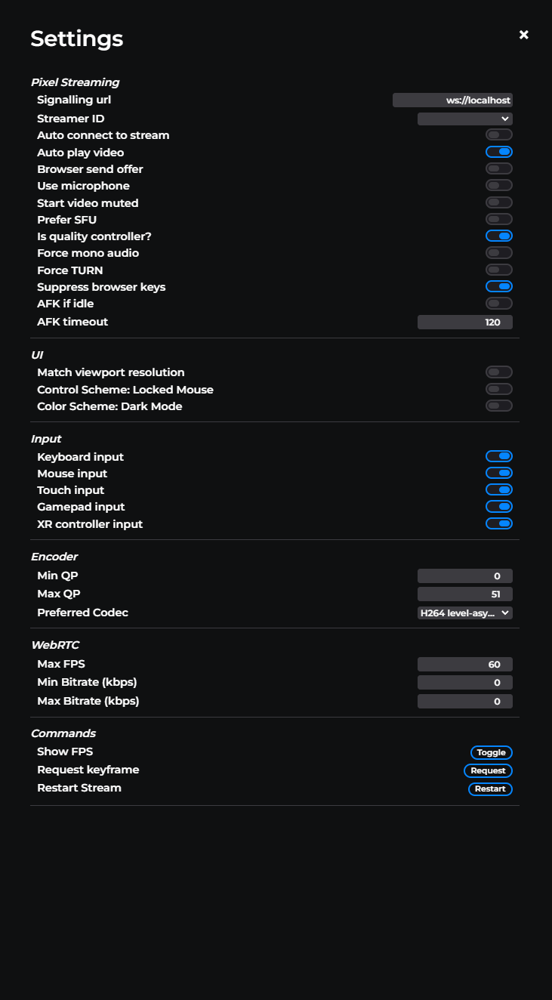

# Front End Setting Panel

With the new Pixel Streaming Front End, we've created a settings panel that allows you to adjust and change settings of your stream on the fly.
This page will be updated with new features and commands available.

## Settings

### Pixel Streaming

| **Setting** | **Description** |
| --- | --- |
| **Signalling URL** | The URL of the signalling server. |
| **Streamer ID** | Allows you to select which streamer to stream. |
| **Auto connect to stream** | Browser will automatically connect to the stream when loaded. Prevents having to click to start |
| **Auto play video** | When stream is ready, starts playing video immediately instead of showing a play button. |
| **Browser send offer** | The browser will start the WebRTC handshake instead of the Unreal Engine application. This is an advanced setting for people customising the front end. Primarily for backwards compatibility for 4.x versions of the engine. |
| **Use microphone** | Will start receiving audio input from your microphone and play it back through the stream. |
| **Start video muted** | Muted audio when stream starts |
| **Prefer SFU** | Will attempt to use the Selective Forwarding Unit, will only work if you have one running. |
| **Is quality controller?** | Makes the encoder of the Pixel Streaming Plugin use the current browser connection to determine the bandwidth available, and therefore the quality of the stream encoding. **See notes below** |
| **Force mono audio** | Force browser to request mono audio in the SDP. |
| **Force TURN** | Will attempt to connect exclusively via the TURN server. Will not work without an active TURN server. |
| **Suppress browser keys** | Suppress or allow certain keys we use in UE, for example F5 to show shader complexity instead of refreshing the page. |
| **AFK if Idle** | Timeout the connection if no input is detected for a period of time. |
| **AFK timeout** | Allows you to specify the AFK timeout period. |

### UI
| **Setting** | **Description** |
| --- | --- |
| **Match viewport resolution** | Visualizes statistics about the connection between the browser and the Unreal Engine application. |
| **Control scheme** | Will dictate if the stream captures your mouse or keeps it free. |
| **Color scheme** | Allows you to switch between light mode and dark mode. |

### Encoder
| **Setting** | **Description** |
| --- | --- |
| **Min QP** | The lower bound of quantization parameter (QP) of the encoder. 0 = best quality, 51 = worst quality. |
| **Max QP** | The upper bound of quantization parameter (QP) of the encoder. 0 = best quality, 51 = worst quality. |
| **Preferred codec** | The preferred codec to be used during codec negotiation. |

### WebRTC
| **Setting** | **Description** |
| --- | --- |
| **Max FPS** | The maximum FPS WebRTC will attempt to transmit frames at. |
| **Min Bitrate (kbps)** | The minimum bitrate WebRTC should use. |
| **Max Bitrate (kbps)** | The maximum bitrate WebRTC should use. |

### Commands
| **Setting** | **Description** |
| --- | --- |
| **Show FPS** | Will display the current FPS |
| **Request Keyframe** | Will ask the stream for a keyframe. This is helpful if your stream is choppy and needs to catch up.  |
| **Restart Stream** | Restarts the peer connection to the stream. Should be used if you change above settings to ensure they are applied. |

### Notes

**Quality Controller**
Although Pixel Streaming adapts the quality of the stream to match the available bandwidth, the video frames are only encoded once by the Pixel Streaming Plugin. That one encoding is used for all clients. Therefore, only one client connection can "own" the quality used for adaptive streaming. If the other clients have a much better connection to the server, they may end up seeing a lower quality stream than necessary. On the other hand, if other clients have a much worse connection to the server, they may end up with lag or jitter.
By default, each time a new browser connects, it adopts the ownership of the stream. Use this checkbox from any other connected browser to retake ownership.

## Legal

Copyright &copy; 2022, Epic Games. Licensed under the MIT License, see the file [LICENSE](./LICENSE) for details.

