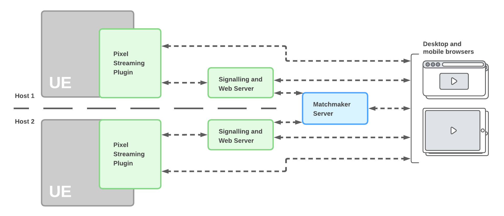

## Multiple Full Stacks with Matchmaking

Instead of having all users connect to the same stream, you may want each person to end up in their own interactive experiences. To do this, you can run a separate stack of Pixel Streaming components for each user, and direct each user to a separate Signaling and Web Server to start a connection.

You can set up each stack of Pixel Streaming components on a separate host, or you can put more than one stack on the same host as long as you configure the port settings for the components within each stack so that they all communicate over different ports. See the [Pixel Streaming Reference](https://docs.unrealengine.com/5.3/en-US/unreal-engine-pixel-streaming-reference/) for details on these port settings.

**Note:** If you plan to run multiple instances of the Unreal Engine using Pixel Streaming on the same computer, remember many consumer-level graphics cards such as the NVIDIA GeForce line can only run a maximum of three encoders at the same time. Professional-grade cards such as the Quadro and Tesla do not have the same limitation.

To help set up this kind of configuration, the Pixel Streaming system can use a matchmaker server that tracks which Signaling and Web Servers are available, and whether they are being used by a client connection.

Instead of each client needing to connect to its own Signaling and Web Server URL, they first connect to the Matchmaker Server. The Matchmaker takes care of redirecting each requester to its own Signaling and Web Server, which sets up the peer-to-peer connection between the client and its UE5 application. As long as that connection is active, the Matchmaker Server will not redirect any new incoming browser connections to the same Signaling and Web Server.

The Pixel Streaming system includes a reference implementation for a Matchmaker Server, under the `Samples/PixelStreaming/WebServers/Matchmaker` folder. You can use this server as-is; or, you can customize the `matchmaker.js` file to fit your needs, as long as you handle the same messages from the Signaling and Web Server.

To set up the Matchmaker Server:

1.  Before you start your Signalling and Web Server, start the Matchmaker Server by running its `run.bat` file. By default, the server listens for HTTP connections from clients on port **90**, and it listens for connections from Signalling and Web Servers on port **9999**. You can override those settings by providing the following configuration parameters on the command line:
    
    | Parameter | Description |
    | --- | --- |
    | **--HttpPort** |  Defines the port the Matchmaker Server listens to for incoming HTTP connections from browsers. |
    | **--MatchmakerPort** | Defines the port the Matchmaker Server listens to for incoming status messages from Signaling and Web Servers. |

    For example:

    \> Start_SignallingServer.ps1 --HttpPort 88 --MatchmakerPort 9988

2.  Set the following configuration parameters for the Signalling and Web Server:
    
    | Parameter | Description |
    | --- | --- |
    | **--UseMatchmaker** | Set this parameter to `true` to make the Signalling Web Server send its current status to the Matchmaker Server. |
    | **--MatchmakerAddress** | The IP address of the Matchmaker Server this Signalling and Web Server will connect to. |
    | **--MatchmakerPort** | The port this Signalling and Web Server will use when it needs to send messages to the Matchmaker Server. Make sure this value matches the **--MatchmakerPort** value you set for the Matchmaker Server. |
    | **--PublicIp** | The publicly visible IP address of the Signalling and Web Server. When the Matchmaker Server redirects a user to this Signalling and Web Server, it sends them to this IP address. Therefore, it has to be visible to the connecting browser. |
    | **--HttpPort** | The port that the Signalling and Web Server listens to for HTTP connections. When the Matchmaker Server redirects a user to this Signalling and Web Server, it sends them to this port. |

    For instructions on how you can set these parameters, see the [Pixel Streaming Reference](https://docs.unrealengine.com/5.3/en-US/unreal-engine-pixel-streaming-reference/)