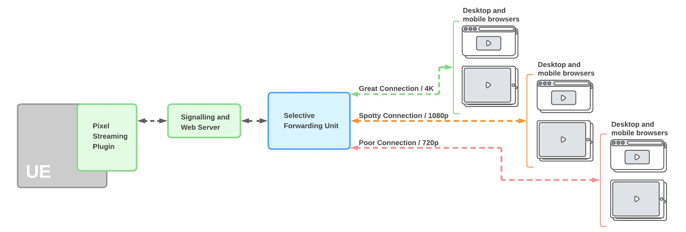
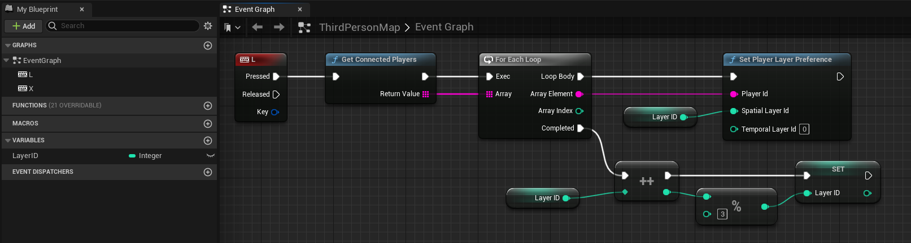
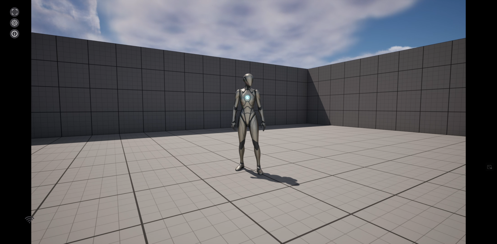
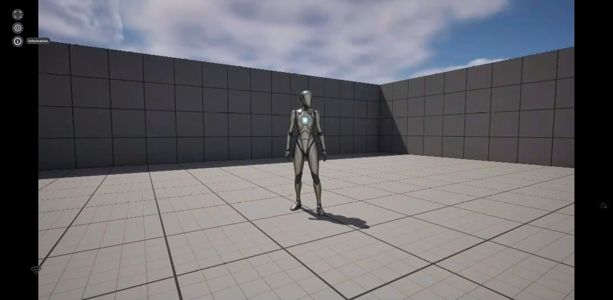
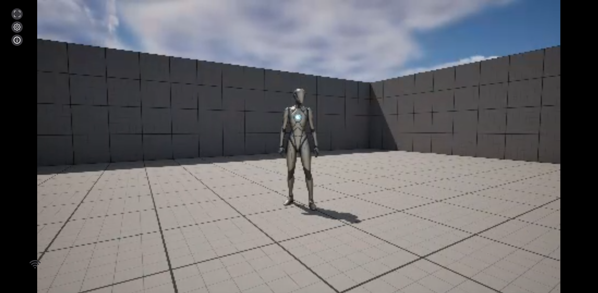

## What is the SFU?

A Selective Forwarding Unit (SFU) is a server which intelligently routes media streams between participants. In Pixel Streaming the role of the SFU is to receive stream data from the Unreal Engine application and deliver it to the recipients peers (typically connected web browsers), optionally subsetting the data to adapt to the prevailing network conditions of each recipient peer.

When using the SFU Pixel Streaming implements the simulcast strategy for adapting stream bandwidth. In the simulcast strategy, the Unreal Instance generates multiple streams at different resolutions. The SFU then selects which quality variant of the stream to transmit to the recipient based on the recipient's network conditions.

**Note:** At this time the SFU feature of Pixel Streaming is experimental.

## When to Use an SFU
An SFU enables a one-to-many stream where there can be more peers connected than would be typically available if all the peers were connected to the Pixel Streaming application in a peer-to-peer fashion. The use of an SFU is often appropriate when your Pixel Streaming application requires multiple connected recipients and those recipients are in varying network conditions that call for different quality stream quality levels (for example, lower bitrates, resolutions, or framerates).

## SFU Configuration
Configuration of the SFU can be achieved by modifying the `config.js` file found in `Samples/PixelStreaming/WebServers/SFU`.

The SFU is configured by default to provide two quality levels. One full resolution stream and one half resolution stream. This configuration can be changed using `-SimulcastParameters=` (See [Pixel Streaming Reference](https://docs.unrealengine.com/5.3/en-US/unreal-engine-pixel-streaming-reference/) for details). 

**Note:** If you are create more than three simulcast streams you may hit up against limits when using the H.264 hardware encoders on consumer GPUs that often have a limit of three encoding sessions.

## Creating a SFU Layer Toggle

To best test the layer-switching functionality of the SFU, we’ve added the blueprints required to force the stream to switch between the available layers of your SFU.

 

Adding the above to your level blueprint lets you use the assigned key as a connected peer to switch layers. 

**Note:** The SFU is designed to automatically switch peers between layers based on their connection, so using this blueprint isn’t required for actual deployments.

 Layer 1 

 Layer 2 

 Layer 3 