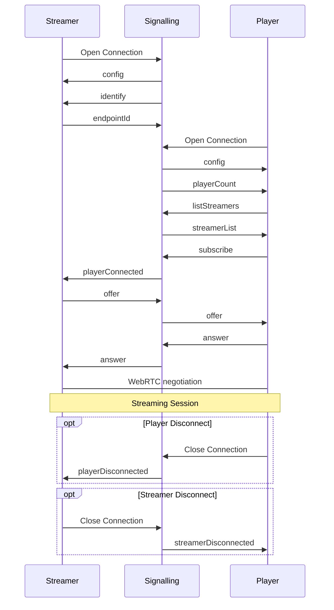

# Pixel Streaming Signalling Protocol

The following is a complete reference to the current signalling server messaging protocol. These messages are sent as stringified JSON packets. Some parameters are JSON strings themselves and require escape sequences to be contained in the string parameter.

## Table of Contents
- [Terms](#terms)
- [Example Streaming Message Sequence](#example-message-sequence)
- [Player Sent Messages](#source-player)
	- [answer](#player-answer)
	- [dataChannelRequest](#player-datachannelrequest)
	- [iceCandidate](#player-icecandidate)
	- [listStreamers](#player-liststreamers)
	- [offer](#player-offer)
	- [peerDataChannelsReady](#player-peerdatachannelsready)
	- [stats](#player-stats)
	- [subscribe](#player-subscribe)
	- [unsubscribe](#player-unsubscribe)
- [SFU Sent Messages](#source-sfu)
	- [answer](#sfu-answer)
	- [offer](#sfu-offer)
	- [peerDataChannels](#sfu-peerdatachannels)
	- [streamerDataChannels](#sfu-streamerdatachannels)
- [Signalling Server Sent Messages](#source-signalling)
	- [config](#signalling-config)
	- [identify](#signalling-identify)
	- [playerConnected](#signalling-playerconnected)
	- [playerCount](#signalling-playercount)
	- [playerDisconnected](#signalling-playerdisconnected)
	- [pong](#signalling-pong)
	- [streamerDisconnected](#signalling-streamerDisconnected)
	- [streamerList](#signalling-streamerlist)
- [Streamer Sent Message](#source-streamer)
	- [answer](#streamer-answer)
	- [disconnectPlayer](#streamer-disconnectplayer)
	- [endpointId](#streamer-endpointid)
	- [iceCandidate](#streamer-icecandidate)
	- [layerPreference](#streamer-layerpreference)
	- [offer](#streamer-offer)
	- [ping](#streamer-ping)

## Terms

### Signalling Server

>The server that is responsible for routing messageas and controlling new connections.

### Streamer

> The entity that is streaming the media.

### Player

> A consumer of the stream. Could be passive or active with the use of data streams.

### SFU

> Selective Forwarding Unit. This is a special type of Player that consumes the stream and then can forward the stream to new connected Players. This is useful when many users need to be consuming the stream and encoding resources on the Streamer are not adequate to keep up with the demand.
> Additionally allows the use of simulcast which allows the Streamer to stream a handful of different quality streams that the SFU can selectively forward to individual Players based on their connection quality.

### SDP

> Session Description Protocol. A message format that is used to negotiate a media connection between two endpoints. There are many resources for further details such as [here](https://www.tutorialspoint.com/webrtc/webrtc_session_description_protocol.htm) or [here](https://webrtchacks.com/sdp-anatomy/)

### ICE Candidate

> Interactive Connectivity Establishment. Describes protocols and routing needed for WebRTC to be able to communicate with a remote device. Further details can be read [here](https://developer.mozilla.org/en-US/docs/Web/API/RTCIceCandidate)

## Example Streaming Message Sequence

## Player Sent Messages

### answer

>Message is forwarded to the currently subscribed to [Streamer](#term-streamer). Sends the [SDP](#term-sdp) answer back to the Streamer The [Player](#term-player) must have previously used the [subscribe](#player-subscribe) message to successfully subscribe to a connected Streamer and received an [offer](#streamer-offer) from the Streamer.

| Param Name | Type | Description |
|-|-|-|
| Sdp | string | The WebRTC SDP package in string format |

### dataChannelRequest

>Message is forwarded to a connected [SFU](#term-sfu). Tells the SFU that the [Player](#term-player) requests data channels to the Streamer.

| Param Name | Type | Description |
|-|-|-|

### iceCandidate

>Message is forwarded to the currently subscribed to [Streamer](#term-streamer). Sends an [ICE](#term-icecandidate) candidate to the Streamer. This is part of the WebRTC negotiation and should come after the [answer](#streamer-answer)

| Param Name | Type | Description |
|-|-|-|
| candidate | string | The JSON string describing the ICE candidate |

### listStreamers

> Message is consumed by the [Signalling Server](#term-signallingserver). Requests the list of streamer ids currently connected to the Signalling Server. The server will reply with a [streamerList](#signalling-streamerlist)

| Param Name | Type | Description |
|-|-|-|

### offer

>Message is forwarded to the currently subscribed to [Streamer](#term-streamer). Supplies an SDP offer to the Streamer to answer. The [Player](#term-player) must have previously used the [subscribe](#player-subscribe) message to successfully subscribe to a connected Streamer.

| Param Name | Type | Description |
|-|-|-|
| Sdp | string | The WebRTC SDP package in string format |

### peerDataChannelsReady

>Message is forwarded to a connected [SFU](#term-sfu). Tells the SFU that the [Player](#term-player) is ready for data channels to be negotiated.

| Param Name | Type | Description |
|-|-|-|

### stats

>Message is consumed by the [Signalling Server](#term-signallingserver). Will print out the provided stats data on the console.

| Param Name | Type | Description |
|-|-|-|
| data | string | The stats data to log. |

### subscribe

> Message is consumed by the [Signalling Server](#term-signallingserver). Tells the Signalling server that the player requests to subscribe to the given stream.

| Param Name | Type | Description |
|-|-|-|
| streamerId | string | The id of the stream to subscribe to. |

### unsubscribe

> Message is consumed by the [Signalling Server](#term-signallingserver). Tells the Signalling Server that the [Player](#term-player) wishes to unsubscribe from the current stream. The player must have previously used the [subscribe](#player-subscribe) message for this to have any effect.

| Param Name | Type | Description |
|-|-|-|

## SFU Sent Messages

### answer

>Message is forwarded to the [Streamer](#term-streamer). Sends the [SDP](#term-sdp) answer back to the Streamer. This should be in response to a previous [offer](#streamer-offer) from the Streamer.

| Param Name | Type | Description |
|-|-|-|
| Sdp | string | The WebRTC SDP package in string format |

### offer

>Message is forwarded to a [Player](#term-player). Sends the [SDP](#term-sdp) offer to the specified Player. This begins the WebRTC negotiation between the [SFU](#term-sfu) and the Player.

| Param Name | Type | Description |
|-|-|-|
| playerId | string | The id of the player to send the offer to. |
| Sdp | string | The WebRTC SDP package in string format |

### peerDataChannels

>Message is forwarded to a [Player](#term-player). Sends information to the Player about what data channels to use for sending/receiving with the [Streamer](#term-streamer).

| Param Name | Type | Description |
|-|-|-|
| playerId | string | The player id of the player to send the message to. |
| sendStreamId | number | The datachannel id for sending data. |
| recvStreamId | number | The datachannel id for receiving data. |

### streamerDataChannels

>Message is forwarded to the [Streamer](#term-streamer). Sends a request to the Streamer to open up data channels for a given [Player](#term-player).

| Param Name | Type | Description |
|-|-|-|
| playerId | string | The id of the player the request is for. |
| sendStreamId | number | The datachannel id for sending data. |
| recvStreamId | number | The datachannel id for receiving data. |

## Signalling Server Sent Messages

### config

> Message is used to send the peer connection options such as stun and turn servers to a connecting [Streamer](#term-streamer)

| Param Name | Type | Description |
|-|-|-|
| peerConnectionOptions | object | The object describing the peer connection options for this server. |

### identify

> Message is used to request an identity from a connecting [Streamer](#term-streamer). The Streamer should reply with an [endpointId](#streamer-endpointId) message. See note in [endpointId](#streamer-endpointid) about legacy Streamers and temporary ids.

| Param Name | Type | Description |
|-|-|-|

### playerConnected

> Message is used to notify a [Streamer](#term-streamer) that a new [Player](#term-player) has subscribed to the stream.

| Param Name | Type | Description |
|-|-|-|
| playerId | string | The id of the new connected player. |
| dataChannel | boolean | Indicates whether the player wants a datachannel or not. |
| sfu | boolean | Indicates if the player is an SFU or not. |
| sendOffer | boolean | Indicates if the new player want's an offer or not. |

### playerCount

> Message is sent to Players to indicate how many currently connected players there are on this signalling server. (Note: This is mostly old behaviour and is not influenced by multi streamers or who is subscribed to what Streamer. It just reports the number of players it knows about.)

| Param Name | Type | Description |
|-|-|-|
| count | number | The number of players currently connected to this signalling server. |

### playerDisconnected

> Message is used to notify a [Streamer](#term-streamer) that a [Player](#term-player) has unsubscribed/disconnected from the stream.

| Param Name | Type | Description |
|-|-|-|
| playerId | string | The id of the new connected player. |

### pong

>Message is a reply to [ping](#streamer-ping) from a [Streamer](#term-streamer). Replies with the time from the ping message.

| Param Name | Description |
|-|-|
| time | The timestamp of the ping message. Will be returned in the pong message |

### streamerDisconnected

> Message is used to notify players when a [Streamer](#term-streamer) disconnects from the [Signalling Server](#term-signallingserver).

| Param Name | Type | Description |
|-|-|-|

### streamerList

>Message is a reply to [listStreamers](#player-liststreamers) from a [Player](#term-player). Replies with a list of currently active [Streamers](#term-streamer) connected to this server.

| Param Name | Type | Description |
|-|-|-|
| ids | Array\<string\> | A list of string ids that are currently active on the signalling server. |

## Streamer Sent Messages

### answer

>Message is forwarded to a [Player](#term-player). Sends the [SDP](#term-sdp) answer back to the player. This should be in response to an [offer](#player-offer) from the specified player.

| Param Name | Type | Description |
|-|-|-|
| playerId | string | The id of the player to send the answer to. |
| Sdp | string | The WebRTC SDP package in string format |

### disconnectPlayer

>Message is consumed by the [Signalling Server](#term-signallingserver). Requests that the Signalling Server disconnect a [Player](#term-player).

| Param Name | Type | Description |
|-|-|-|
| playerId | string | The id of the player to disconnect |
| reason | string | The reason for the disconnect |

### endpointId

>Message is consumed by the [Signalling Server](#term-signallingserver). Specifies an id for the [Streamer](#term-streamer). This is used to uniquely identify multiple streamers connected to the same Signalling Server. Note: to preserve backward compatibility when Streamer ids were optional, when a Streamer first connects it is assigned a temporary ID (\_\_LEGACY\_\_) which allows use of older Streamers if needed.

| Param Name | Type | Description |
|-|-|-|
| id | string | The id of the Streamer |

### iceCandidate

>Message is forwarded to a [Player](#term-player). Sends an [ICE](#term-icecandidate) candidate to the specified player.

| Param Name | Type | Description |
|-|-|-|
| playerId | string | The id of the player to send the ICE candidate to. |
| candidate | string | The JSON string describing the ICE candidate |

### layerPreference

>Message is forwarded to a connected [SFU](#term-sfu). Sends a preferred layer index to a connected SFU for a specified [Player](#term-player). Useful for switching between SFU quality layers to force a certain resolution/quality option either as part of UX or testing.

| Param Name | Type | Description |
|-|-|-|
| playerId | string | The id of the player to give the preference to |
| spatialLayer | number | The index of the spatial layer to prefer |
| temporalLayer | number | The index of the temporal layer to prefer |

### offer

>Message is forwarded to a [Player](#term-player). Sends the [SDP](#term-sdp) offer to the specified player. Begins the WebRTC negotiation with a player.

| Param Name | Type | Description |
|-|-|-|
| playerId | string | The id of the player to send the offer to. |
| Sdp | string | The WebRTC SDP package in string format |

### ping

>Message is consumed by the [Signalling Server](#term-signallingserver). A keepalive ping message that initiates a [pong](#signalling-pong) response.

| Param Name | Type | Description |
|-|-|-|
| time | number | The timestamp of the ping message. Will be returned in the pong message |
